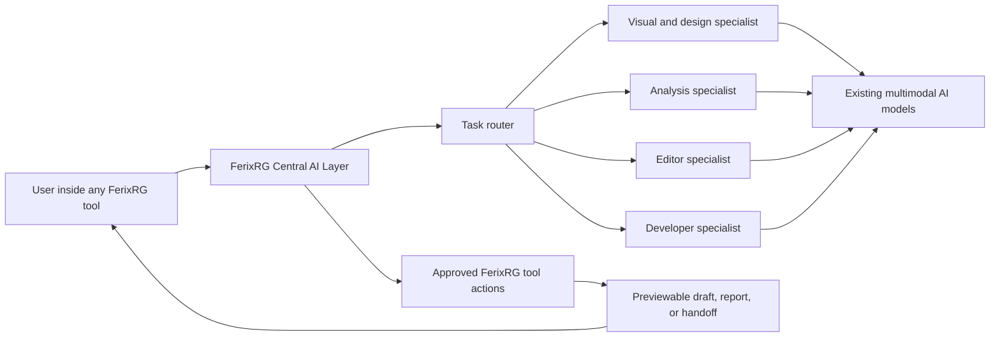

# FerixRG Central AI Decision

## The direct answer

FerixRG should build its own **Central AI Layer**, but it should **not train a new foundation model from scratch**. The Central AI Layer is FerixRG-owned software that understands the current user, tool, store, page, evidence, draft, and permission context. It uses existing strong AI models as its reasoning and vision capability, then gives those models controlled FerixRG actions.

This means FerixRG becomes more than a chat window connected to an AI API. It becomes a design and storefront-intelligence system with one central AI that can work across all tools while retaining product-specific memory, tool rules, drafts, reviews, and approvals.



## What kind of AI FerixRG needs

FerixRG is primarily a **design and storefront intelligence product**, not a general coding product. The central AI must therefore be a **multimodal, tool-using agent**.

| AI capability | Why FerixRG needs it | Example user request |
|---|---|---|
| **Multimodal design intelligence** | Understands screenshots, storefront sections, visual hierarchy, spacing, typography, products, and references. | “Make this product page look more premium, like this reference.” |
| **Text and reasoning intelligence** | Understands goals, creates content, explains issues, prioritizes fixes, and turns vague instructions into a proposal. | “Make the page clearer and improve the first purchase journey.” |
| **Tool-using agent ability** | Lets AI choose from safe FerixRG actions, such as inspecting a page, reading a draft, generating a comparison, or creating a proposal. | “Find the most important problems and fix them.” |
| **Structured output** | Returns controlled draft operations, findings, evidence links, severity, confidence, and explanations instead of uncontrolled text. | “Create a mobile layout proposal I can review.” |
| **Coding intelligence** | Helps only when a user runs developer/theme/code work. It is a specialist, not the whole central AI. | “Explain the theme conflict and create a developer handoff.” |

> **Decision:** the main FerixRG AI is a multimodal design agent with controlled tool actions. A coding agent is one specialist available to it; it is not the whole product AI.

## What FerixRG builds versus what it uses

| Part | FerixRG builds it | FerixRG uses an existing service or model |
|---|---:|---:|
| Central AI identity, prompts, workspace context, store awareness, tool routing, permission checks, draft rules, approval rules, memory, audit records | Yes | No |
| Design understanding, visual reasoning, writing, planning, code reasoning, and image interpretation | No | Yes—through selected existing AI models |
| Agent action registry | Yes | No |
| Store-platform adapters and release controls | Yes | No—platform APIs are called through FerixRG adapters |
| Technical checkers, crawler/rendering, comparison, conversion, export, and validation tools | FerixRG integrates and controls them | Yes—use established technical libraries or services where appropriate |

## The central AI is an agent, but a controlled one

An agent is not just a chatbot. It can plan a task, call approved tools, look at the result, decide its next safe step, and return a completed proposal. Official agent frameworks describe this as an application that plans, calls tools, and preserves enough state for multi-step work. [1]

For FerixRG, the agent must be **bounded**. It cannot access a store, edit content, publish, or call an external integration simply because it decides to. It can only select a named action from FerixRG’s approved action registry, and each action checks user role, store capability, and approval state before it runs.

| AI may do automatically | AI must stop and request review | AI may never decide alone |
|---|---|---|
| Inspect authorized evidence, summarize findings, suggest fixes, create a draft, compare alternatives, prepare a report | Apply a draft to a connected store, use a new permission, overwrite a meaningful version, send developer handoff externally | Publish a store change, rollback a published version, change billing, invite/remove a team member, expose credentials |

## How a user interacts with the central AI

The user will see one consistent FerixRG AI Copilot in every relevant tool. The AI Copilot is aware of the exact screen and tool the user opened; the user does not need to explain the whole product every time.

```text
User: “Make the product section easier to understand on mobile.”
    ↓
Central AI understands: current store + selected page + responsive tool + current draft
    ↓
It reads permitted evidence and asks the Responsive/Design specialist to create a proposal
    ↓
It returns: findings + explanation + previewable change set + before/after comparison
    ↓
User can modify, accept, reject, or ask for another version
```

This same AI is available across all tools, but it changes specialist behavior by tool. For example, the Visual Design Analyzer gives it visual-analysis instructions; the Content Editor gives it content-editing instructions; the Theme/Code Analyzer gives it a developer-analysis instruction set. The user sees one AI, while the backend supplies the correct specialist and permitted actions.

## The recommended technical route

| Option | What it means | Fit for FerixRG | Decision |
|---|---|---|---|
| **Build a foundation model from scratch** | Train and operate a large AI model ourselves. | Not appropriate. It requires huge data, specialized AI research, and substantial computing infrastructure before it could match existing multimodal models. | Do not use. |
| **Use a ready-made all-in-one AI agent product as FerixRG itself** | Hand the central user experience, agent loop, and tools to another product. | Too limiting. FerixRG would lose control of its drafts, tool contracts, store permissions, and product identity. | Do not use as the core product. |
| **Self-host an open-source model from the start** | Run a model ourselves through software such as Ollama or vLLM. | Useful later for privacy, fixed-cost volume, or custom control, but it requires persistent model serving and suitable compute; it is not the fastest way to reach high-quality multimodal design work. [2] [3] | Keep as a later option. |
| **Build FerixRG’s own agent layer around managed multimodal model APIs** | FerixRG owns the tools, context, safety, drafts, and user experience; existing models provide visual and reasoning capability. | Best first production path: high quality, faster to build, provider-independent design, no model training required. | **Use this.** |

## Model routing inside the central AI

FerixRG does not need one model for every task. The Central AI Layer selects the model route based on the job, while keeping one consistent FerixRG personality and tool policy for users.

| Work type | Central-AI route | Why |
|---|---|---|
| Screenshots, design references, storefront visuals, long page context | Vision-capable multimodal model | The AI must understand both visuals and instructions. |
| Content rewriting, CTA suggestions, metadata, summaries, quick assistant replies | Fast structured language model | These are frequent, bounded requests and need speed and cost control. |
| Complex redesign direction, conflicting evidence, difficult design reasoning | Strong reasoning model | These tasks benefit from more planning before a proposal is created. |
| Theme/code explanation and developer handoff | Coding/reasoning specialist | This is the specific place where a coding AI is useful. |

The model catalog is read by the backend, not hard-coded in the browser. The current managed catalog includes models with tool-calling, vision, structured-output, and reasoning capabilities, which is the capability set FerixRG needs for the central agent. [4]

## What we will implement first

1. **Central AI gateway.** One server-only service that accepts a FerixRG AI request, loads authorized context, chooses a model route, and returns a typed result.
2. **Tool action registry.** A list of only the actions AI is allowed to request, such as `inspectEvidence`, `createDraftProposal`, `compareDrafts`, and `prepareDeveloperHandoff`.
3. **AI run and approval records.** Every agent action, model call, proposed change, user approval, and blocked action is saved for review.
4. **First specialist: Design Copilot.** This is the right initial test because it proves design context, user interaction, proposals, draft creation, and review in one workflow.
5. **Shared AI availability.** Once the gateway and action registry are working, every tool can call the same Central AI Layer with its own specialist policy.

## What the user needs to provide later

FerixRG can be built around a managed model route first. When we activate a production provider or a direct provider account, the required API credentials are stored only in secure server configuration. The user never pastes provider keys into the browser or a tool prompt.

The only later business choice is whether FerixRG should keep using a managed AI route at launch or connect direct provider accounts under the business. This does not change the FerixRG AI architecture; it changes only the provider behind the Central AI gateway.

## References

[1] [OpenAI Agents SDK overview](https://developers.openai.com/api/docs/guides/agents)

[2] [Ollama API introduction](https://docs.ollama.com/api/introduction)

[3] [vLLM quickstart and server requirements](https://docs.vllm.ai/en/latest/getting_started/quickstart/)

[4] [Built-in AI model catalog guidance](../../../skills/builtin-llm-models/SKILL.md)
