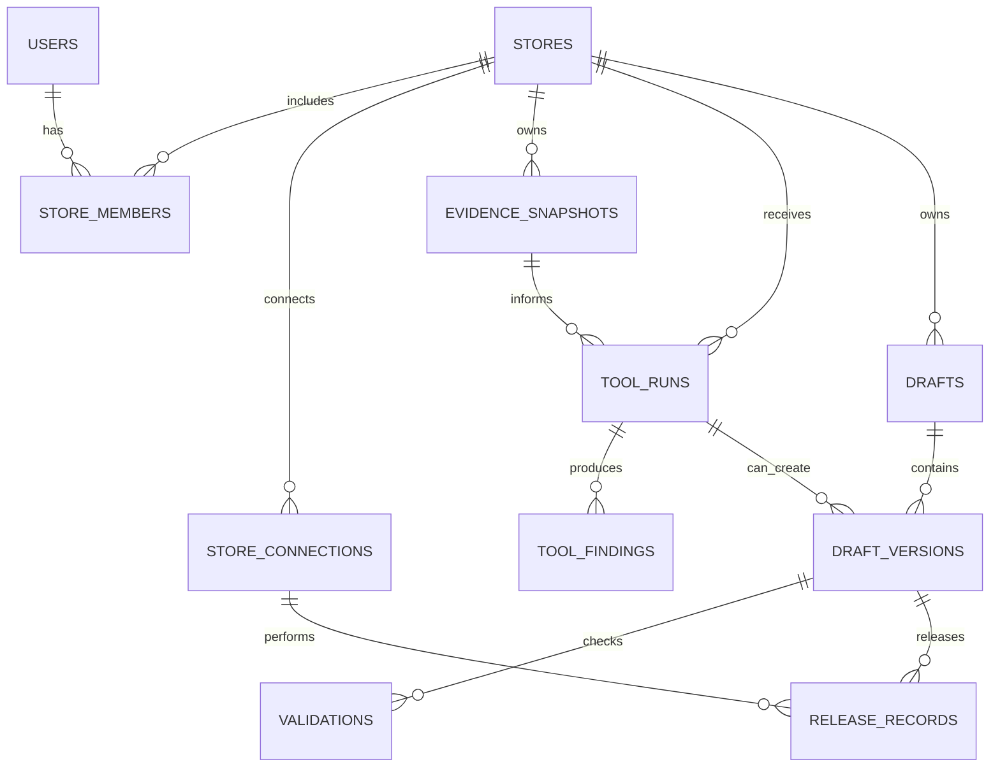

# FerixRG Backend Domain Model

## Design principle

FerixRG separates **who owns a store**, **what information was observed**, **what a tool concluded**, **what a user changed**, and **what was released**. This prevents an AI proposal from being treated as a published change and prevents a connection token from becoming a general user permission.

## Core records

| Record | Key fields | Ownership and security rule |
|---|---|---|
| `stores` | ID, display name, platform, canonical URL, status, owner organization | A store belongs to an organization/workspace, never just to a browser session. |
| `store_members` | Store ID, user ID, role, status | Roles are `owner`, `editor`, `viewer`, and later `publisher`; permissions are checked per store. |
| `store_connections` | Store ID, platform, external store ID, granted scopes, capability flags, status, expiry, last health check | This record describes a connection but does not expose its token. A connector may have read-only access without publish access. |
| `connection_secrets` | Connection ID, encrypted access material, key version, rotation metadata | Kept server-side only; excluded from API responses, logs, exports, and AI prompts. |
| `evidence_snapshots` | Store ID, source type, source URL or external resource ID, captured time, content hash, parser version | Immutable source-of-truth input for a run. A later page change creates a new snapshot. |
| `evidence_assets` | Snapshot ID, asset type, storage key, MIME type, width, height, checksum | Holds screenshots, visual references, HTML extracts, parsed metadata, or authorized theme-file references. |
| `tool_runs` | Store ID, requested tool, initiator, input profile, status, model route, cost counters, started/finished timestamps | One record per actual execution. It reveals status and results to authorized members but not secrets. |
| `tool_findings` | Run ID, category, severity, evidence locator, rule ID, confidence, title, explanation, recommendation | Stores evidence-backed measurable findings separately from AI advice. |
| `tool_reports` | Run ID, report version, summary, export key | Immutable generated report referencing findings rather than duplicating hidden connection data. |
| `drafts` | Store ID, page or resource target, title, status, current version ID | The shared container for manual and AI changes. |
| `draft_versions` | Draft ID, parent version, change set, author kind, author user, originating run, preview key | An AI proposal and a manual edit are versions in the same history. |
| `validations` | Draft version ID, validation type, baseline ID, status, blockers, result payload | A release requires current validations, not a remembered old score. |
| `release_records` | Draft version ID, connection ID, requested by, approved by, action, status, remote reference, rollback reference | Every publish and rollback is an auditable, explicit event. |
| `audit_events` | Actor, store, resource type, action, redacted metadata, timestamp | Captures security-sensitive actions including connection, scope change, publish, rollback, and member changes. |

## Status model

| Area | Allowed status progression |
|---|---|
| Connection | `pending` → `connected` → `needs_reauth` / `restricted` / `disconnected` |
| Tool run | `queued` → `collecting_evidence` → `checking` → `interpreting` → `completed` or `failed` / `cancelled` |
| Draft | `active` → `ready_for_validation` → `validated` → `ready_for_release` → `released` or `archived` |
| Release | `requested` → `approved` → `publishing` → `published` or `failed` / `rolled_back` |

## Permission model

Users receive roles from FerixRG, while platform adapters report technical capabilities. A user can only perform an action when **both** conditions are true.

| User role | May do | Never may do by role alone |
|---|---|---|
| `viewer` | Read allowed results, reports, and versions | Edit a draft, reconnect a store, or release a change |
| `editor` | Run permitted tools, create drafts, apply manual or AI proposals, validate, export | Publish or revoke a connection without explicit publisher or owner authority |
| `publisher` | Request and approve releases for capabilities granted to the connection | Bypass validation, access ungranted data, or publish beyond the connector’s supported scope |
| `owner` | Manage members, connection permissions, release authority, and deletion rules | Access secrets in plain text or override platform limitations |

> **Publish authorization requires four checks:** the FerixRG user has publishing authority; the connection is healthy; the platform adapter reports the needed capability; and the exact draft version has passed its required validations.

## Data boundaries for AI

The AI service receives a short-lived, scoped request object. It may include approved text, sanitized structural evidence, image URLs with signed temporary access, current draft operations, and explicitly selected platform metadata. It must not receive connection secrets, unnecessary customer information, raw payment data, unrelated store records, or hidden audit data.

Every AI response is saved as a proposed `tool_finding` or `draft_version` with the source run, evidence identifiers, selected model route, token/cost usage, and output schema version. This allows FerixRG to explain which evidence AI used and lets a user reject or restore a proposal.

## First schema milestone

The first implementation will introduce the records needed before platform credentials are accepted: `stores`, `store_members`, `tool_runs`, `tool_findings`, `drafts`, `draft_versions`, `validations`, `release_records`, and `audit_events`. Connection and secret tables will be added with the first platform adapter, after that platform’s security configuration and requested scopes are finalized.
